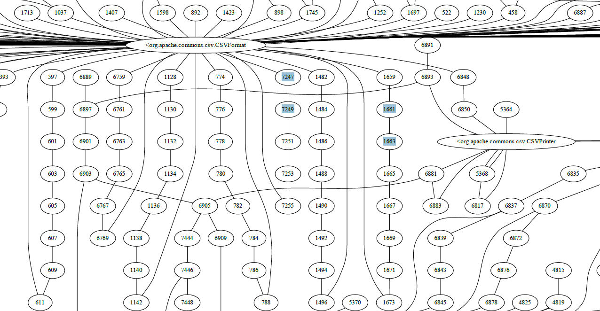

# Milestone 1 Submission
* Kevan Yang
* Alex Huynh
* Tommy Ge

## Overview
We have created AST, CG, and CFG representations and visualizations for the `commons-csv` open source Java repo.
Our deliverables include, the representations we've generated, and the code to create these reperentations, and a script
to run the code in an automated manner.

## Representations
### AST

### CG
[File Here](visualization/cg-representation.gv.pdf) 

### CFG
[PDF File Here](visualization/cfg-output.gv.pdf) 
Please note: due to the long names of the CFG nodes and branches, we have another file for the mappings of numbers to nodes: 
[Mapping File Here](visualization/cfg-mapping.txt) 

# Generating AST/CG/CFG
## The static_analysis.py script is to be used as follows:

To run the code, the user needs Java downloaded and also graphviz installed on their machine for both Java and Python.

Download the script and jar files. In a command line, the script can be run with the following command:

python static_analysis.py --representation [AST/CG/CFG] --input [file path]

to generate the respective representation for the file given. Note that your file path should be relative to where the script is located - not the absolute path. Also note that path name should use '/' instead of '\\'. 

Now we will show some examples of generating the AST/CG/CFG. The source code we tested our graph visualizations on was the Apache commons-csv project which can be found here: https://github.com/apache/commons-csv

Here's an example of the script and it's output:

python3 static_analysis.py --representation AST --input "commons-csv/src/main/java/org/apache/commons/csv/Token.java"

Note that the script produces both the .dot file and a .png file for easier viewing.

## Running different programs manually (Preferred method), For CG and CFG
You can run the Java files on IntelliJ.
The `CallGraphExample.java` file generates the CG representation while the `CFGBuilder.java` file generates the CFG representation.
`CallGraphExample.java` will generate the cg representation in `graph.txt`.
`CFGBuilder.java` will generate the cfg representation in `graph1.txt` and `graph2.txt`
 

Move the files visualization directory. You must have `Graphviz` the program on your machine and its library installed on Python.
In the visualization directory run: 
### For CG representation:
`python visualizeCG.py optionalFile` 
Without a text representation file name passed in, it defaults to `graph.txt`. 
The program will generate `cg-representation-gv.pdf`.
### For CFG representation:
`python visualizeCFG.py optionalFile1 optionalFile2` 
Without file arguments passed in, it defaults to `graph2.txt` and `graph3.txt`. 
The program will generate `cfg-output-gv.pdf`.
It  will also generate `cfg-mapping.txt` to show the key, node mappings in the graph.

You can checkout many of the representations and scripts for them in the `visualization` directory.